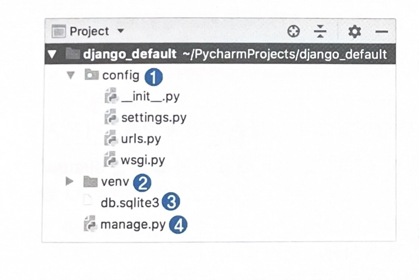

## Django
* 장고란?
    * WSGI 라는 미들웨어 방식
    * 적은 리소스로 높은 효율성을 냄
    * 가장 빠른 시간내에 웹 서비스를 구현할 수 있는 웹 프레임워크
    * 생산성이 좋다
        * 웹 서비스를 만들 때 필요한 대부분의 기능들을 미리 정형화된 형태로 준비해 두었다.
    * 데이터베이스와 통신을 위해 다양한 드라이버를 지원하고 ORM 방식을 통해 데이터베이스를 다룰 수 있다.
    * 다양한 기본 미들웨어를 사용해 웹 어플리케이션 보안성이 높다.

* 프로젝트 구조
 